# Agent Mandate Security Review V2

**Assessment date:** 2026-08-29

**Reviewed revision:** `208ecb9e48cb40383cb496951847e98999224f0a` (`post-submission/v2`)

**Review posture:** adversarial, read-only, financial-institution standard

**Overall decision:** **not production-ready for custody or movement of real institutional funds**

## Executive conclusion

Agent Mandate has a meaningful on-ledger control, not merely a UI check. Under the
assumptions that Canton executes the submitted Daml transaction correctly, the
pinned `TransferFactory` implementation is honest, and the submitting identity has
only the intended rights, `ChargeAndSettle` atomically enforces recipient,
instrument, expiry, positive amount, and cumulative gross-debit cap. The transaction
cannot commit a token transfer while rolling back the Mandate update, or commit the
Mandate update while rolling back the token transfer. The Daml tests substantively
exercise this property, including failures after the nested transfer.

That is the strongest part of the system. It is also narrower than the product
thesis can safely imply.

The current system delegates the owner's transaction authority into a selectable
`TransferFactory`, relies on participant package vetting and Token Standard
implementation behavior, uses a shared and not independently attested DevNet
credential, and has no durable/idempotent settlement state machine. A response lost
after commit can be reported as “No value moved”; a retry receives a new command ID
and can make a second payment. The repository's UI is a fixture simulation, the
live adapter is unimplemented, and the repository contains no reproducible ledger
evidence for its later DevNet claims. Receipts are useful shared ledger records but
are not immutable, independently unforgeable, purpose-bound, or WORM audit records.

The correct institutional characterization is therefore:

> The Daml package provides a strong atomic, per-Mandate policy check inside a
> correctly operated Canton transaction. It does not remove trust in the owner's
> participant, credentials, vetted packages, the pinned settlement implementation,
> the token registry, or the client-side retry and state-reconciliation machinery.

## Scope and method

This review read:

- every checked-in Daml source, including the Mandate, mock token and settlement
  implementations, scripts, and vendored Token Standard interfaces;
- `agent_demo.py`, `agent_session.py`, `c8lab.py`, and all Python tests;
- the UI data source, presenter, policy simulator, application, server, and all UI
  tests;
- the root and component READMEs, API/runtime/setup/deployment/troubleshooting
  documents, challenge notes, and submission deck/video source;
- the DevNet assumptions and the documented credential/rights/package workflow.

No DevNet endpoint was contacted. No Daml, runtime, UI, or test implementation was
changed. This report is the sole source change.

The following Digital Asset primary documentation was used to distinguish code
properties from platform assumptions:

- [Daml updates and transaction failure](https://docs.digitalasset.com/build/3.5/reference/daml/updates.html)
- [Ledger API services, change IDs, deduplication, and disclosure](https://docs.digitalasset.com/build/3.4/explanations/ledger-api-services.html)
- [Daml runtime authorization](https://docs.digitalasset.com/build/3.4/reference/glossary.html)
- [Canton ledger integrity](https://docs.digitalasset.com/overview/3.4/explanations/ledger-model/ledger-integrity.html)
- [Canton topology and participant trust](https://docs.digitalasset.com/overview/3.4/explanations/canton/topology.html)
- [Canton protocol and privacy](https://docs.digitalasset.com/overview/3.4/explanations/canton/protocol.html)
- [Canton security and external signing](https://docs.digitalasset.com/overview/3.4/explanations/canton/security.html)
- [Canton synchronizer](https://docs.digitalasset.com/subnet/3.4/overview/index.html)
- [Explicit contract disclosure](https://docs.digitalasset.com/build/3.4/sdlc-howtos/applications/develop/explicit-contract-disclosure.html)
- [Daml numeric data types](https://docs.digitalasset.com/build/3.4/reference/daml/data-types.html)
- [Canton pruning](https://docs.digitalasset.com/overview/3.4/explanations/canton/pruning.html)

## Assurance levels used in this report

| Label | Meaning |
|---|---|
| Verified | Established by source reasoning and a directly relevant passing local test. |
| Code-established | Direct consequence of reviewed code, but not exercised under the full deployed stack. |
| Assumed | Required of Canton, a participant, a package, a credential, or an external service; not established by this repository. |
| Unproven | Claimed or operationally necessary, but the repository has insufficient evidence. |
| Falsified | Contradicted by source or test evidence. |

Passing mocks and fixture tests are not promoted to live-system evidence.

## Trust-boundary reconstruction

```mermaid
flowchart LR
    U[Human / calling application] -->|free-form instruction| L[External LLM endpoint]
    L -->|untrusted JSON strings| P[agent_demo parser and alias map]
    P -->|bounded recipient, amount, transfer args| S[agent_session / c8lab]
    S -->|Bearer credential + actAs spender\nreadAs owner + disclosed contracts| PA[Owner/spender Participant]
    PA -->|command submission| SY[Canton synchronizer]
    SY -->|ordered confirmation protocol| PN[Involved participant nodes]
    PN --> M[Mandate Daml package]
    M -->|nested owner-authorized exercise| F[Pinned TransferFactory contract]
    F --> R[Token Standard registry / implementation]
    R --> H[Owner and recipient holdings]
    M --> RC[Successor Mandate + receipt]

    ADM[Participant administrator / operator] -. controls users, rights, packages,\nparty hosting, operations .-> PA
    VET[Package vetting and package preferences] -. selects trusted executable code .-> PN
    TA[Token administrator / validator automation] -. signs/administers token state\nand preapprovals .-> R
    DS[UI FixtureDataSource] -. synthetic only; no ledger connection .-> U
```



The security boundary is not “the LLM versus Daml.” It includes every component
that can submit as the owner, select or vet Daml code, administer the token,
construct disclosed-contract context, or decide whether a timed-out command is
retried.

### Authority and trust inventory

| Component or actor | Authority/data actually held | Security consequence |
|---|---|---|
| Owner | Mandate signatory; unilateral `SetFactory` and `Revoke`; direct authority over the owner's token workflows where its credential can act | Owner credential compromise can bypass the Mandate entirely through a direct token transfer. |
| Spender/agent | Mandate signatory and controller of both `Charge` and `ChargeAndSettle`; sees Mandate and receipts | Can settle within policy and can consume allowance without settlement via `Charge`. |
| Owner + spender jointly | Controllers for `Adjust` and `Reauthorise`; both are receipt signatories | Can create arbitrary receipts directly, archive receipts jointly, raise/lower caps, and change allowlists. |
| Recipient | Observer on its `ChargeReceipt`; token receiver | Sees more than payment receipt data: cumulative spend, cap, expiry, owner, spender, and mandate identifier. |
| Python runtime | Bearer token, parties, Mandate CID, endpoint configuration; imports a module containing write/admin helpers | Runtime compromise is qualitatively stronger than prompt injection and may bypass the intended narrow agent path depending on rights. |
| Participant operator/admin | Ledger users and rights, hosted party authority, package upload/vetting/preferences, availability and local ledger view | A sufficiently privileged or malicious operator can bypass application controls and may submit in a hosted party's name. |
| Synchronizer | Ordering, time/coordination, routing metadata, encrypted envelopes | Required for liveness and ordering; does not ordinarily see plaintext payloads, but does see metadata and is not a zero-knowledge service. |
| Pinned TransferFactory implementation | Receives authority derived from the Mandate transaction and returns the result used for accounting | Its semantics are trusted. The interface type and `expectedAdmin` argument do not prove honest implementation. |
| Token registry/admin | Token implementation, holdings, transfer/preapproval semantics and relevant signatures | Monetary conservation and final recipient holdings ultimately depend on this implementation and its administration. |
| External LLM service | User instruction and prompt content | It is an untrusted intent proposer and a privacy/data-governance processor, not an authority source. |
| UI fixture | Local JavaScript state and synthetic identifiers | Demonstration only. It proves no ledger state or transaction outcome. |

## Daml authority analysis

### Signatories and controllers

`Mandate` is signed by both `owner` and `spender` (`Mandate.daml:96`). This means
both parties see the contract and both authorize its creation. It does **not** mean
both must authorize every later choice: controllers define that.

- `Charge`: spender alone. It consumes and recreates the Mandate and creates an
  `AuthorisedOnly` receipt, but transfers no token.
- `ChargeAndSettle`: spender alone. It consumes the Mandate, executes the pinned
  factory inside the same transaction, then creates a successor and `Settled`
  receipt.
- `SetFactory`: owner alone. It consumes and recreates with an arbitrary supplied
  `ContractId TransferFactory`.
- `Adjust`: owner and spender jointly.
- `Reauthorise`: owner and spender jointly.
- `Revoke`: owner alone and creates no successor.

Nested authority is important. The owner is a signatory of the consumed Mandate,
so its authority is available to consequences in the choice body. The included
`AuthorityStealingBoundary` test deliberately demonstrates that a malicious factory
can use this authority to exercise an unrelated owner-controlled contract. This is
not a compiler or Canton defect; it is the expected Daml authorization model and a
hard trust boundary around factory code.

### Owner versus spender capability

The spender cannot expand cap, extend expiry, change instrument, change factory, or
change allowlist alone. The owner can revoke and rotate the factory alone. However,
the owner cannot lower the cap or narrow the allowlist without the spender's
cooperation. A hostile or unavailable spender can refuse a tightening; the owner's
only unilateral safe response is revoke and issue a replacement. That is workable
as a recovery workflow but not equivalent to an atomic in-place reduction.

The non-settling `Charge` choice is more serious than a harmless test helper. A
spender can repeatedly consume allowance and create authoritative-looking
`AuthorisedOnly` receipts without moving value. It cannot steal token through that
choice, but it can permanently exhaust authorization, disrupt service, distort
cumulative-spend interpretation, and force owner intervention.

### Policy fields and edge cases

| Control | Result |
|---|---|
| Allowlist | Enforced in both charge choices with exact `Party` equality. Template construction also requires a non-empty, unique list and excludes owner/spender. Python aliases cannot expand it. |
| Cumulative cap | `Charge` uses nominal amount; `ChargeAndSettle` uses measured `grossDebit`. Successor state carries `spent`, and consume/recreate serializes one contract lineage. |
| Zero/negative | Template requires positive cap; charge choices require amount `> 0`; spent and fees cannot be negative. A malformed client therefore fails at Daml even if Python preflight is weak. |
| Decimal precision | Daml `Decimal` is exact `Numeric 10`: 38 total digits, 10 after the point. Python preflight converts to binary `float`, so client decisions can diverge at boundaries. No boundary/overflow/scale suite establishes the complete input contract. |
| Expiry | `getTime < expiresAt`; the exact expiry instant is rejected. Ledger time, sequencing, and availability remain infrastructure assumptions. |
| Revocation | Owner can archive unilaterally. A concurrent charge and revoke on the same CID race; ordering decides the winner. Once revocation commits, that CID cannot later be charged. |
| Re-authorization | Requires both owner and spender and preserves spent/cap/expiry/instrument/factory. Owner can instead revoke and replace. |
| Cap adjustment | Requires both; `newCap >= spent`; template invariant also requires positive cap. It cannot forgive already-accounted spend. |
| `SetFactory` | Owner-only rotation preserves policy state. It does not validate implementation provenance, expected admin, package hash, or behavior before accepting the new CID. |
| Instrument pinning | Transfer and every fetched input/change holding must exactly match the Mandate's `InstrumentId`. The factory is separately pinned by CID. |
| Expected admin | Passed as the instrument admin to the factory. An honest compliant implementation validates it; a malicious implementation can ignore an argument. |
| Duplicate inputs | Explicitly rejected before factory exercise. This prevents double-counting the same input CID. |
| Duplicate change | Explicitly rejected after factory exercise. The corresponding adversarial test verifies rollback. |
| Gross versus nominal | Cap is charged by `inputTotal - senderChangeTotal`; fee is that value minus nominal recipient amount. Negative fee and gross cap overflow abort. This is better than nominal-only accounting. |
| Receipts | Include nominal amount, gross debit, fee, settlement kind, sequence and policy snapshots. They do not contain a business/idempotency ID, user instruction, reason, model response, or command ID. |
| Observer visibility | Receipt recipient is an observer; Mandate recipients are not observers. See the privacy matrix below. |
| Consume/recreate | Gives one live successor per successful choice and conflict detection for the same CID. It also makes clients responsible for durable successor discovery. |

### Gross-debit limit: what is and is not proved

For an honest Token Standard factory result, the contract measures what left the
owner rather than merely trusting requested amount. It checks input/change CID
uniqueness, fetches all named holdings through the interface, verifies their owner
and instrument, and charges the difference including fee.

The interface does not cryptographically establish that the returned
`senderChangeCids` are complete, newly created by this transfer, or the only relevant
owner outputs. Nor does `ChargeAndSettle` fetch and verify the returned receiver
holdings. A malicious factory can return semantically dishonest `Completed` data,
use unrelated authority available in the transaction, or choose misleading
existing holdings as alleged change if they are fetchable. Correct conservation and
result semantics are therefore a property of the exact vetted implementation, not
of `TransferFactory` interface conformance alone.

## Settlement atomicity

### Proposition 1

**Claim:** If settlement fails, no Mandate allowance can be consumed.

**Verdict: verified, with a precise scope.** A `ChargeAndSettle` is one Daml
transaction. Failure before the nested exercise prevents it. A `Pending` or `Failed`
result explicitly aborts. Failure in any validation after the nested exercise also
aborts the entire transaction, including nested token effects and the consuming
Mandate exercise. No successor or receipt is committed. This is both a Daml
transaction semantic and exercised by `SettlePendingAborts`, `GrossDebitFees`,
`DuplicateChangeRejected`, and other scripts.

It does **not** mean a client will always know whether settlement failed. A network
error after server commit leaves the ledger in a valid committed state while the
client is uncertain. It also does not apply to the separate non-settling `Charge`
choice, which intentionally consumes allowance without settlement.

### Proposition 2

**Claim:** If Mandate validation fails, no Canton Coin can move.

**Verdict: verified for value movement attempted inside that same
`ChargeAndSettle` transaction.** Pre-factory validation fails before token code runs.
Post-factory validation aborts the entire transaction, rolling back nested effects.
There is no intermediate commit point.

This must not be generalized to “Canton Coin cannot move except through Mandate.” A
credential or participant able to act as the owner can submit a different valid
token transfer that never mentions the Mandate. A malicious factory may also misuse
authority for effects not captured by the intended settlement semantics. The
Mandate is a transaction-local policy, not a global encumbrance on all owner
holdings.

### Intermediate failure analysis

| Stage | Representative failure | Ledger result | Client certainty today |
|---|---|---|---|
| Intent/parser | non-JSON, extra/missing fields, non-string, non-finite amount, unknown alias | No submission; no ledger effect | Certain |
| Read/preflight | auth failure, party/ACS/registry lookup error, no holdings, insufficient observed balance | No submission; no ledger effect | Certain, subject to correct logging |
| Command authorization | missing `actAs`, invalid token, owner/spender right mismatch | Transaction rejected; no ledger effect | Certain if a definitive rejection is returned |
| Contract resolution | stale/archived/wrong Mandate CID, package mismatch, missing disclosed contract | Transaction rejected; no ledger effect | Certain if a definitive rejection is returned |
| Mandate prechecks | expired, disallowed recipient, nonpositive amount, nominal cap overflow, wrong sender/instrument, empty/duplicate/wrong input | Transaction aborted; no ledger effect | Certain if a definitive rejection is returned |
| Factory execution | stale factory, expected-admin/context rejection, locked/archived holding, failed authorization, registry error | Entire transaction aborted; no allowance or token effect | Certain if a definitive rejection is returned |
| Factory result | `Pending` or `Failed` | Explicit Daml abort; no allowance or token effect | Certain if returned as a definitive rejection |
| Post-factory checks | duplicate/bad change, fetch failure, negative fee, gross cap overflow | Entire transaction, including nested transfer, aborted | Certain if a definitive rejection is returned |
| Contract creation | successor/receipt invariant or authorization failure | Entire transaction aborted | Certain if a definitive rejection is returned |
| Submission transport | timeout/reset after POST, malformed/lost success response | May have committed once or not at all; never a partial Daml commit | **Ambiguous and mishandled** |
| Retry | a new random command ID is generated | Can commit a second semantically identical payment against the successor | No business-level deduplication |

The current `agent_demo.run_action` catches a `LabError` and prints “No value moved.”
`c8lab._request` uses the same error type for HTTP failures, timeouts and OS-level
transport errors as for definitive ledger rejection. That message is unsound after
an ambiguous POST. The Daml transaction is atomic; the client's knowledge is not.

## Stateful sessions and concurrency

`agent_session` improves on a stateless command by adopting the successor CID from a
successful response. That state exists only in process memory.

- There is no durable journal linking an intent, stable business operation ID,
  command ID, submission ID, completion, receipt and successor CID.
- `c8lab.submit` generates a fresh UUID command ID for each call. A retry therefore
  opts out of the platform's change-ID deduplication for the semantic operation.
- A transport failure leaves the old CID in memory even if the transaction committed.
  The next request hits a stale CID. The application does not query completion,
  reconcile receipts, or discover/adopt the active successor.
- A successful response missing `mandateCid` halts the session, which is safer than
  guessing, but there is no supported recovery path.
- Process restart restores only the configured initial/current CID, not authoritative
  ledger state.
- The interactive loop serializes actions in one process. Multiple processes or
  operators do not share a lock.
- Two actions exercising the same active Mandate CID cannot both commit. Canton's
  contract consumption conflict makes one lose. This protects the per-Mandate cap,
  but the loser still requires reliable classification and successor recovery.
- Two independent Mandates over the same wallet can both spend their own allowances.
  There is no global wallet cap, velocity limit, daily cap, or aggregate exposure
  control.
- Selecting every matching unlocked holding increases transaction size and the
  collision surface with other wallet activity. Coin selection is not deterministic
  or reservation-aware.

“Stale CID rejection” is therefore a ledger safety mechanism, not a production
session design.

## Identity and infrastructure trust

### Shared DevNet credential and rights

The documentation describes a shared hackathon credential and an intended minimum
of `CanActAs(spender)` plus `CanReadAs(owner)`, explicitly excluding
`CanActAs(owner)`. It also records unresolved live rights/identity steps. No checked-in
rights snapshot or independently reproducible query proves the credential actually
has that least-privilege shape.

If the runtime credential can act as the owner, compromised Python can submit a
direct Token Standard transfer and bypass Mandate policy. If it has
`ParticipantAdmin`, compromise can grant rights, create identities, and alter the
operational/package environment. The repository contains `c8lab` commands for party
allocation, rights grants, generic submission, and direct transfer. Those commands
are not exposed to the LLM, but their presence underscores that process compromise
and prompt injection are different threat classes.

### Participant administrator/operator

A party hosted on a participant trusts that participant. Digital Asset's topology
documentation explicitly notes that a malicious participant with confirmation
permission can submit in the party's name. The operator also controls local Ledger
API users/rights, package availability and vetting/preferences, retention, and much
of the party's availability and observable ledger view. Daml protects against
unauthorized normal submissions as evaluated by honest nodes; it is not a defense
against the owner intentionally delegating authority to a malicious host.

External-party/transaction signing and threshold operational controls can reduce
this trust. They are not implemented here.

### Package vetting and factory pinning

Checking exact official interface DARs into the build and excluding mock packages
from the production Mandate DAR are positive controls. They do not attest the
deployed implementation package, the participant's package preferences, its vetting
state, or the behavior of a particular factory CID.

The factory contract is pinned by CID for each Mandate and can be rotated only by
the owner. That prevents a registry lookup alone from silently changing it. However,
the owner can set any type-correct factory CID, and the nested code remains trusted.
Package vetting means an operator agrees that code may run; it is not a proof that
the code conserves value, validates `expectedAdmin`, or reports result holdings
honestly.

### Synchronizer, registry, disclosures, and preapprovals

- The synchronizer orders/coordinates the atomic protocol and affects time and
  liveness. Its outage or censorship can block both charge and revoke. A revoke is
  effective after commit, not an out-of-band instantaneous kill switch.
- Canton synchronizer payloads are encrypted for intended recipients, but routing,
  timing and ordering metadata remain visible. “Canton is private” is too broad.
- Explicit disclosure lets a submitter use contracts it does not otherwise see. The
  disclosed blob and contract identity are validated by the participant/protocol;
  disclosure is not a substitute for code trust or stakeholder authorization.
- The Token Standard registry response supplies context/disclosed contracts and
  transfer-kind classification. `ChargeAndSettle` uses the pinned factory and aborts
  `Pending`, but the exact implementation and registry/admin behavior remain trusted.
- Receiver preapproval is an operational prerequisite for direct completion in the
  demonstrated flow. Missing, expired, revoked or automation-delayed preapproval
  should fail atomically, but it can cause denial of service.

## LLM and application boundary

### What is protected

The LLM returns only three untrusted strings. Local code requires an exact JSON
shape, rejects unknown fields and malformed/non-finite amounts, resolves a
case-insensitive alias from configured data, and invokes one bounded settlement
function. It gives the model no shell, generic Ledger API command, rights-management
tool, or code-execution tool. Prompt injection cannot add a Daml recipient, increase
the cap, alter expiry, change the instrument/factory, or grant ledger rights. Final
policy is enforced again in Daml.

### What remains exposed

- The LLM can choose any configured alias and amount based on hostile prompt text.
  There is no human confirmation, transaction-risk scoring, or purpose policy.
- The alias file/environment is itself a trusted routing table. Compromise can map a
  human-friendly name to a different already-allowed party. Daml blocks an off-list
  party but cannot determine whether “pharmacy” meant the intended legal entity.
- `c8lab.find_party` uses prefix-style discovery for several operational paths.
  Ambiguous naming can choose an unintended party; on-ledger checks generally make
  this fail or constrain it, but exact party IDs should be treated as controlled
  configuration.
- `reason` is printed but not committed to the transfer or receipt. Ledger evidence
  cannot bind a payment to the instruction or explain its purpose.
- Instructions are sent to a configurable external inference endpoint. That is a
  privacy, retention, residency and vendor-risk boundary.
- Python performs a binary-float holdings preflight while Daml uses exact fixed-point
  decimal. The ledger remains authoritative, so this is more likely to cause false
  acceptance/rejection or malformed submissions than a cap bypass, but it should
  not exist in an institution-grade money path.
- The runtime process contains secrets and imports a broader laboratory module.
  Remote code execution or dependency compromise can use whatever rights the bearer
  token actually has; strict model parsing does not mitigate that.

The UI is a separate fixture implementation. `app.js` always instantiates
`FixtureDataSource`; `LiveDataSource` throws “not implemented” for all ledger-facing
operations. The fixture repeats allowlist/cap/expiry logic in JavaScript, rounds to
thousandths, mutates local state, and manufactures contract/update identifiers. This
is acceptable as clearly labelled demo theater, but its “Canton decision,” settled
events, and technical proof are synthetic and must never be presented as evidence
of a particular ledger transaction.

## Privacy analysis

Canton provides need-to-know transaction projection, not blanket confidentiality.
Visibility depends on stakeholders, transaction subviews, hosting participants,
Ledger API rights, token implementation roles, and operational metadata.

| Data | Who can see it in this design | Important caveat |
|---|---|---|
| Active Mandate | Owner and spender; their hosting participant nodes; Ledger API users with corresponding read/act rights | Contains full allowlist, cap, spent, expiry, instrument, factory, mandate ID and charge count. Recipients do not see it merely by being allowlisted. |
| ChargeReceipt | Owner and spender as signatories; that receipt's recipient as observer; their hosting participants/read-authorized users | Recipient sees owner, spender, amount, gross debit, fee, sequence, `spentAfter`, `capAtCharge`, expiry and mandate ID. This leaks aggregate policy/spend data across counterparties. |
| Payment/holdings | Owner/sender and receiver according to Token Standard stakeholders; token admin/registry roles and their hosting infrastructure as defined by the deployed implementation | Exact visibility must be verified against the deployed Canton Coin packages and transaction projection; it is not proved solely by the interface source. |
| Recipient identity | Owner, spender and receipt recipient; relevant participant operators and token roles | Other allowlisted recipients are visible to owner/spender through the Mandate, not normally to each recipient. |
| Reason/instruction | Calling application/terminal and configured LLM provider; fixture UI when used | Not present in Mandate, receipt, or transfer evidence. Ledger stakeholders cannot recover it from these contracts. |
| Cumulative spend | Owner and spender from Mandate; every receipt recipient gets the `spentAfter` and `capAtCharge` snapshot for its transaction | This is unnecessary cross-recipient disclosure for many institutional use cases. |
| Network metadata | Synchronizer/operator can observe routing, timing, ordering and encrypted envelope metadata | Payload encryption does not hide all relationship/traffic metadata. |
| Historical records | Participant storage and any external index/export controlled by operators | Active contracts persist, but transaction history may be pruned. Receipts are archivable by both signatories jointly. No WORM retention is implemented. |

## Threat matrix

“Currently mitigated” describes only controls present in this revision, not proposed
future work.

| ID | Severity | Issue | Exploit / prerequisite | Financial consequence | Currently mitigated? | Limitation type | Recommended remediation |
|---|---|---|---|---|---|---|---|
| AM-01 | **Critical** | The pinned factory receives delegated owner authority and its result semantics are trusted. The included test proves unrelated owner authority can be exercised. | Owner selects a malicious factory, participant vets malicious code, factory/admin compromise, or deceptive upgrade/operations. | Theft or unauthorized owner-side effects; false “Completed” result; allowance/accounting manipulation. | CID pinning and owner-only rotation reduce accidental switching; input/change/gross checks constrain honest results, not malicious code. | Architectural trust boundary. | Restrict to institution-approved exact implementation package/CIDs; attest vetting/preferences; isolate authority; redesign settlement so untrusted factory code cannot inherit unrelated owner authority; verify result provenance/conservation. |
| AM-02 | **Critical** | Ambiguous submission outcomes are reported as “No value moved”; retries use fresh random command IDs and have no business idempotency. | POST commits, response is lost/times out, operator or automation retries after adopting/discovering successor. | Duplicate payment and duplicate fee up to remaining cap; false operational record. | Per-CID consumption prevents two commits against the same stale CID, but does not deduplicate a semantic retry against the successor. | Application/operational architecture. | Durable operation journal; stable command/business ID; completion lookup; ledger reconciliation by receipt; explicit `UNKNOWN` state; never assert non-commit from transport error. |
| AM-03 | **Critical** | Actual shared DevNet credential rights and administrator exposure are not attested. If it can act as owner or administer rights, Mandate can be bypassed. | Credential leakage/runtime compromise plus `CanActAs(owner)` or `ParticipantAdmin`; malicious participant operator. | Arbitrary direct transfers, rights escalation, package manipulation, total wallet loss. | Documentation states a safer intended rights shape and includes checks, but repository evidence does not prove deployed state. | Deployment/identity trust; architectural participant trust. | Dedicated non-shared identity; prove and continuously monitor exact rights; prohibit owner act-as/admin in agent runtime; separate admin plane; external/threshold signing for owner-sensitive actions. |
| AM-04 | **High** | Spender-only `Charge` burns allowance and creates receipts without settlement. | Any malicious or compromised spender credential. | Denial of authorized payments, misleading cumulative activity, forced revoke/reissue. | Cap limits total damage; settlement field says `AuthorisedOnly`; no token theft through this choice. | Daml/product architecture. | Remove from production package or give it a distinct non-financial authorization object/counter; prevent it from mutating settlement allowance. |
| AM-05 | **High** | Session state is volatile and successor discovery/reconciliation is absent. | Restart, lost response, missing response field, concurrent client, manual CID reuse. | Stuck automation, erroneous rejection, unsafe manual retry, operational loss. | Successful in-process response adoption; missing successor halts. | Application architecture. | Durable state machine indexed by mandate ID; ACS/update-stream successor discovery; recovery tooling; single writer/lease per Mandate. |
| AM-06 | **High** | Receipts are not institution-grade immutable audit evidence. Both signatories can create arbitrary receipts and jointly archive them; history may be pruned; reason/command provenance absent. | Owner+spender collusion/compromise, retention policy, or ordinary archive; auditor trusts active ACS without creation transaction. | Fabricated/deleted evidence, inability to prove purpose or exactly-once instruction. | Ledger transaction history can prove creation provenance while retained; multiple stakeholders see records. | Architectural/audit design. | Factory-controlled receipt issuance, provenance validation, external append-only/WORM export, retention policy, operation/command/purpose hashes and signatures. |
| AM-07 | **High** | Owner cannot unilaterally reduce cap or narrow allowlist; hostile spender can refuse. | Spender compromise or unavailability during policy tightening. | Continued exposure until revoke/reissue wins sequencing; service disruption. | Owner can revoke unilaterally. | Daml governance choice. | Add owner-only non-increasing cap/expiry and narrowing operations, with precise successor semantics; retain joint approval for expansions. |
| AM-08 | **High** | UI is entirely fixture-backed and the live data source is unimplemented. Synthetic IDs and locally repeated policy can be mistaken for ledger proof. | Demo output used for assurance, screenshots shown without fixture context, or fixture logic reused in a live control path. | False approval/settlement evidence and governance decisions based on simulated state. | Fixture badge/disclaimer and honesty tests. | Demo limitation today; becomes architectural if reused. | Keep fixture isolated; build a read-only ledger-backed verifier before any live UI; cryptographically/linkably display transaction/contract evidence and finality state. |
| AM-09 | **High** | Deployed package hashes, vetting/preferences, factory implementation, registry/admin and rights state are not reproducibly evidenced. | Supply-chain/operator error or malicious vetted package; institutional reviewer relies on source checkout. | Different code can execute from reviewed code; loss or policy bypass. | Exact interface dependencies and production/mock DAR separation in source. | Deployment assurance limitation. | Release manifest/SBOM and DAR hashes; signed deployment attestation; automated rights/vetting/package-preference/factory verification; change control. |
| AM-10 | **High** | Receipt observer model discloses cap, expiry and cumulative spend to every paid recipient. | Any allowed recipient receives one payment. | Commercial/privacy leakage; counterparties infer budget and other activity. | Canton limits it to stakeholders rather than public broadcast. | Architectural privacy design. | Minimize recipient receipt projection; split private owner/spender audit record from recipient proof; avoid cross-counterparty cumulative fields. |
| AM-11 | **High** | Token movement is not globally encumbered by Mandate; any valid owner-authorized route can bypass it. | Owner credential, owner participant, another app, or alternate contract path has owner authority. | Transfers outside allowlist/cap/expiry with no Mandate receipt. | Intended runtime rights should exclude owner act-as. | Fundamental architecture/claim boundary. | Custody/escrow funds in a contract whose only release path enforces policy, or enforce transaction policies/external signing at the actual owner authority boundary. |
| AM-12 | **Medium** | Python uses binary `float` for monetary preflight while Daml uses exact scale-10 Decimal. Boundary/scale/overflow behavior is not comprehensively tested. | Adversarial/high-precision amount or balance near boundary. | False preflight acceptance/rejection, malformed submissions, inconsistent operator messaging; Daml should still block cap bypass. | Exact original string reaches Daml; ledger policy is authoritative; model parser rejects non-finite Decimal. | Implementation quality. | Use `Decimal` end-to-end with explicit scale/range policy; test 10/11 decimal places, max magnitude, fee boundaries, and serialization. |
| AM-13 | **Medium** | Coin selection submits every matching unlocked holding without reservation or deterministic selection. | Busy wallet, many holdings, concurrent transfers. | Higher conflict/rejection rate, oversized commands, retry pressure and operational denial. | Duplicate CIDs are rejected; ledger prevents double spend. | Application scalability/reliability. | Deterministic minimal coin selection, reservation/serialization, input count limits and conflict-aware retry/reconciliation. |
| AM-14 | **Medium** | No aggregate wallet, time-window, velocity, per-recipient, or transaction-count limits exist across Mandates. | Multiple valid Mandates or repeated allowed transfers. | Exposure can exceed the risk appetite implied by one Mandate cap. | Each Mandate's lifetime gross cap is enforced. | Product/control-scope limitation. | Add portfolio-level controls at custody/authorization layer and monitor aggregate exposure. |
| AM-15 | **Medium** | Alias configuration can redirect human intent among already-allowed parties; operational prefix lookup can be ambiguous. | Environment/config compromise, lookalike names, ambiguous party prefixes. | Payment to the wrong but authorized recipient; semantic fraud not caught by Daml. | Exact Party allowlist blocks authority expansion beyond policy. | Application/configuration trust. | Signed/versioned legal-entity-to-Party registry, exact identifiers, collision rejection, display/confirm resolved legal identity. |
| AM-16 | **Medium** | User instructions/reasons are disclosed to a configurable external LLM provider without a defined data-governance control in this repo. | Sensitive payment narrative sent to configured endpoint or endpoint compromise. | Confidentiality/regulatory breach; possible social-engineering influence on intent. | Only bounded output reaches settlement; API key is not deliberately exposed to model prompt. | Application/vendor trust. | Data classification, approved endpoint/residency/retention, redaction, no-LLM path for structured requests, vendor monitoring. |
| AM-17 | **Medium** | “Instant revocation” is vulnerable to sequencing and availability nuance. A concurrent charge can win; synchronizer/participant outage can delay revoke. | Charge already sequenced or infrastructure unavailable. | One final within-policy payment may settle before revocation; longer exposure during outage. | Once revoke commits, stale CID cannot be exercised. | Distributed-system/claim limitation. | State the finality semantics; priority operational path, monitoring, low caps/short expiry, external signer/custody pause mechanism. |
| AM-18 | **Medium** | Broad lab/admin/write helpers are colocated with the narrow runtime module and bearer-token environment. | Python RCE, dependency compromise, operator mistake; actual rights support the command. | Broader ledger/admin actions than intended runtime path. | LLM has no generic tool and `agent_demo` only calls the settlement helper. | Operational hardening. | Split read/admin/demo tools from production runtime artifact; separate credentials/processes; allowlist egress and Ledger API methods. |
| AM-19 | **Medium** | Reason and model/input provenance are off-ledger and not linked to receipt or payment. | Dispute, audit, model manipulation, or log loss. | Cannot prove why payment was requested/approved or bind ledger result to an instruction. | Console/fixture displays reason transiently. | Audit/application architecture. | Commit privacy-preserving purpose/request hash and stable operation ID; signed external evidence store with access controls. |
| AM-20 | **Medium** | Repository DevNet claims are internally inconsistent and lack raw reproducible evidence. | External audience treats deck/video narrative as verified deployment evidence. | Assurance failure and potentially misleading security claims. | Some documents explicitly say unverified; later assets label numbers as live/verified. | Demo/evidence limitation. | Publish a dated signed evidence bundle: network, parties, rights, package hashes/vetting, CIDs/update IDs, redacted transaction trees and independent reproduction steps. |

**Severity count:** 3 Critical, 8 High, 9 Medium.

## Verified invariants

The following are verified within the reviewed Daml model and local Canton Script
tests, subject to correct Canton execution and the exact reviewed package:

1. A committed `ChargeAndSettle` has an allowlisted receiver, positive nominal
   amount, correct owner sender, pinned instrument, and ledger time before expiry.
2. Nominal spend and measured gross debit cannot make `spent` exceed `cap`.
3. Named input and change holdings cannot be duplicated; every named input/change is
   fetched and checked for owner and instrument.
4. `Pending` and `Failed` transfer results abort rather than create an optimistic
   successor/receipt.
5. Any pre- or post-factory assertion failure aborts the entire transaction; nested
   token effects and Mandate consumption cannot commit separately.
6. A successful charge consumes the old Mandate and creates one successor with
   incremented spent/sequence state; concurrent use of the same old CID cannot both
   commit.
7. The spender alone cannot enlarge cap, alter allowlist, expiry, instrument or
   factory through the defined choices.
8. The owner can revoke or rotate the factory without spender approval.
9. An off-list alias or prompt-selected Party is rejected on ledger even if Python
   submits it.
10. The reviewed LLM path exposes no generic shell, Ledger API submit, party
    allocation or rights-grant tool to model output.

## Unproven or falsified invariants

1. **Unproven:** the deployed agent credential lacks `CanActAs(owner)` and
   `ParticipantAdmin` and has only intended read/spend rights.
2. **Unproven:** the deployed Mandate/factory/token packages and package preferences
   equal the reviewed code and approved versions.
3. **Unproven:** the pinned live factory honestly validates admin/context, conserves
   Canton Coin, and reports complete/accurate input, change and receiver holdings.
4. **Falsified:** “a failed client call means no value moved.” Ambiguous transport
   failure can follow a committed transaction.
5. **Falsified:** “retries are safe/exactly once.” Calls generate fresh command IDs
   and no business idempotency record exists.
6. **Falsified:** “the UI shows actual ledger state.” It always uses fixture data;
   the live adapter is unimplemented.
7. **Falsified:** “receipts are immutable.” Both signatories can jointly exercise
   implicit `Archive`, and participant history may be pruned.
8. **Falsified:** “a Mandate is required for owner funds to move.” It does not
   encumber holdings or eliminate other owner-authorized token paths.
9. **Unproven:** live DevNet settlement, rights, balances, preapprovals, package
   vetting and claimed transaction identifiers; only narrative evidence is checked in.
10. **Unproven:** correctness under timeout-after-commit, concurrent clients,
    restart, stale successor recovery, package upgrade and large ACS conditions.
11. **Unproven:** institutionally acceptable privacy for participant operators,
    token administrators, recipients, the LLM vendor and synchronizer metadata.
12. **Unproven:** durable audit retention and binding of payment to human intent,
    model output, legal purpose, command ID and approval chain.

## Top 10 engineering risks

1. Ambiguous commit plus unsafe retry can create duplicate real payments.
2. Malicious/compromised factory code can inherit and misuse owner authority.
3. An owner-capable or administrator runtime credential bypasses the Mandate entirely.
4. No deployment attestation binds reviewed source to packages, vetting, factory,
   rights and live network state.
5. Volatile successor-CID state has no reconciliation or crash recovery.
6. The non-settling `Charge` lets a spender burn allowance without paying anyone.
7. Receipts lack immutable retention, exclusive provenance, purpose and idempotency.
8. Owner cannot unilaterally tighten an existing cap or allowlist.
9. Fixture UI/demo evidence can be mistaken for live ledger assurance.
10. Privacy design exposes cumulative policy/spend data to recipients and sensitive
    instructions to an external inference service.

## Top 5 misconceptions that must never be claimed externally

1. **“The AI cannot move money outside the Mandate.”** The narrow model-output path
   cannot, but any component that can act as owner, including a privileged runtime or
   participant, can use other valid token paths.
2. **“If the app says the transaction failed, no money moved.”** Only definitive
   ledger rejection proves that. A transport timeout/reset is `UNKNOWN` until
   reconciled.
3. **“The receipt is an immutable, complete audit trail.”** It is jointly archivable,
   prunable in history, jointly forgeable by its signatories, and omits purpose and
   request/command provenance.
4. **“Canton means the payment and policy are private.”** Stakeholders, hosting
   participants, authorized users, token roles and metadata observers each see
   defined portions; recipients currently learn cumulative spend and cap.
5. **“The demo proves production security.”** The UI is synthetic, tests are local or
   mocked, and checked-in evidence does not independently establish live packages,
   rights, identities, vetting, transactions, concurrency or failure recovery.

## Priority remediation sequence

1. **Close the authority/deployment boundary.** Give the agent a dedicated,
   continuously attested least-privilege identity with no owner/admin authority;
   separate admin tooling; pin and attest exact DAR/factory/token implementations and
   vetting/preferences; evaluate external or threshold signing and custody-level
   encumbrance.
2. **Build an exactly-once settlement state machine.** Persist a business operation
   ID and stable command ID before submission; distinguish rejected/committed/unknown;
   query completions and ledger updates; reconcile receipts and successors; serialize
   each Mandate; make recovery safe after restart and ambiguous failure.
3. **Redesign settlement and audit trust.** Remove or isolate non-settling `Charge`,
   constrain factory authority/result claims, add owner-only policy tightening, bind
   signed request/purpose provenance, minimize receipt disclosure, and export
   creation-provenance-verified records to controlled immutable retention.

## Test execution and evidence limits

Commands executed from the isolated audit worktree:

```text
$env:UV_CACHE_DIR = Join-Path $env:TEMP 'agent-mandate-audit-uv'
uv run --no-project --offline python -m unittest -v
node --test ui/test/mandate.test.mjs
daml build --all
daml test --all
```

Results:

- Python: **45/45 passed**.
- UI: **21/21 passed**.
- Daml: **21/21 scripts passed** after the required local `daml build --all` created
  the ignored dependent DAR.

The Daml suite includes useful adversarial coverage for expiry/revocation, cap,
authorization, pending settlement rollback, direct settlement, factory rotation,
fees/gross debit, duplicate change, malicious factory behavior, and nested authority.

Material gaps remain: no live-network test, no transport fault injection after
commit, no command-deduplication test, no concurrent/multi-process session test, no
restart/reconciliation test, no deployment-rights or package-vetting attestation,
no real Token Standard implementation conformance test, and no privacy/retention
verification. Python/session tests mock ledger calls; UI tests validate a fixture.

## Final assessment

The central atomic settlement invariant is real and valuable. It is not enough for
institutional deployment. The system is presently a credible demonstration of how a
Daml transaction can couple policy state with a Token Standard call, plus a useful
set of adversarial model tests. It is not yet a custody architecture, an exactly-once
payment service, a deployably attested control plane, or an institution-grade audit
system.

The most damaging failure would not require breaking Daml. It would exploit an
already-trusted boundary: owner-capable credentials, participant administration,
vetted factory code, or ambiguous client retries. Production work should start
there, not with further prompt engineering or UI polish.
